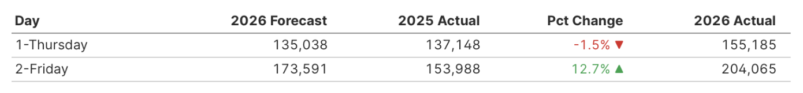
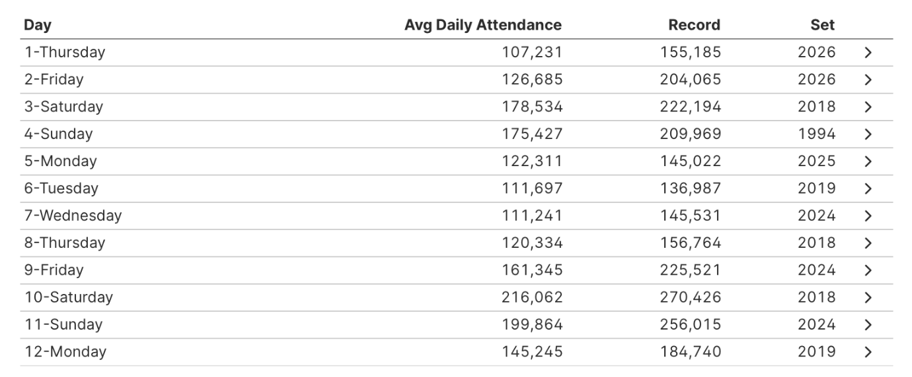

Two days into the fair and two records broken?? We're off to a busy year at the fair! For the first Friday, I estimated that we'd break the record at just 173k attendees, but that was blown out of the water with attendance coming in at 204k.

  

Friday was a Blue Ribbon day when it came to the weather with a high in the low 70s, no chance of rain. As soon as we got to the almost full Burnsville Park N' Ride, I knew we were in for a crowded day at the fair. We hopped in our first line of the day to catch the bus around 8:30AM, pulling up to the fair by 10AM. In line, we started hearing other attendees speculate why it was so busy on the first Friday. For many suburban school districts, school kicks off before Labor Day, so families with young kids may have tried to fit in their annual fair visit before the school year starts.

For both days of the fair, my forecast was under by about 15%. I hope that number goes down over the fair, but we might just keep breaking more records! When I was calculating the forecast for daily attendance in 2026, I assumed that the early start to the school year would lead to a higher overall attendance, as fewer families might be traveling around the holiday. We'll have to wait on the overall attendance, but just two days in, and both days set the all-time attendance records. Will the trend continue?

  

How did each daily forecast do compared to the average attendance for that day?

Over the last 29 years, the average attendance for the first day of the fair (Thursday) was 105,578, making the 2026 attendance of 155,185 about 50% higher than the average. It's an even larger deviation from the average for the first Friday coming in at about 65% higher than the average.

As we get further into the fair, we'll explore more theories on what's driving attendance. What did I miss during the forecasting process? What information could increase my certainty when making the forecast?

Thanks for exploring some of the numbers with me! Much more to come!