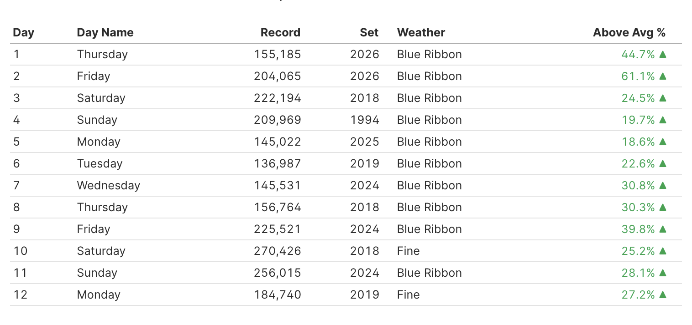
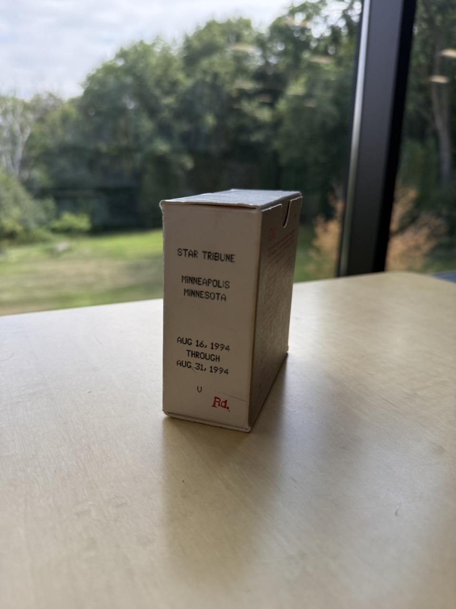
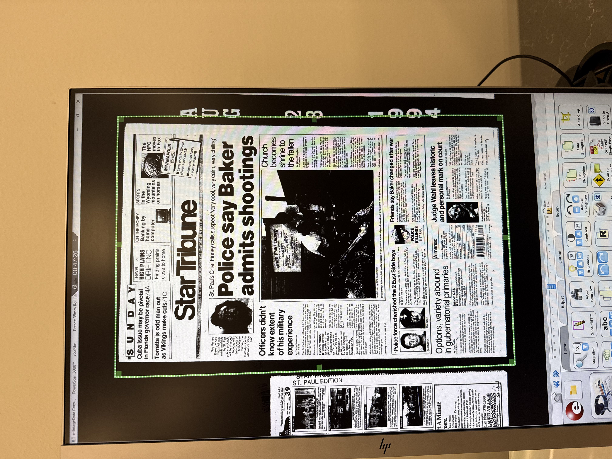
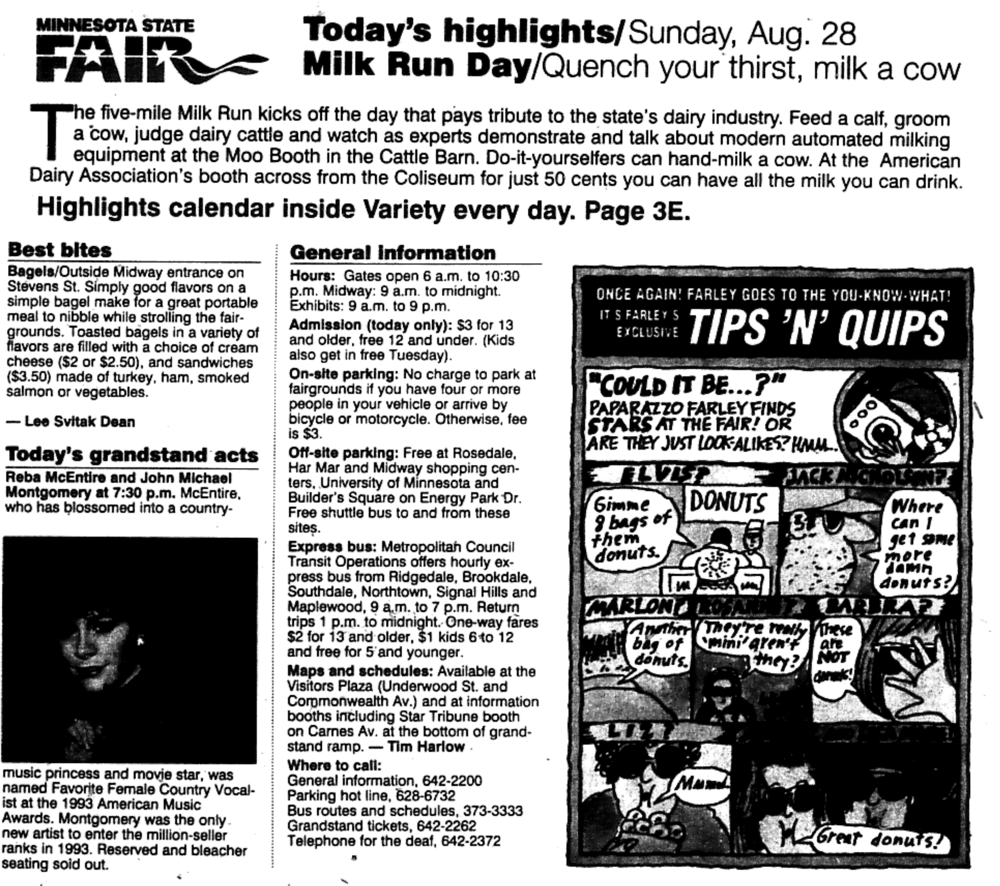
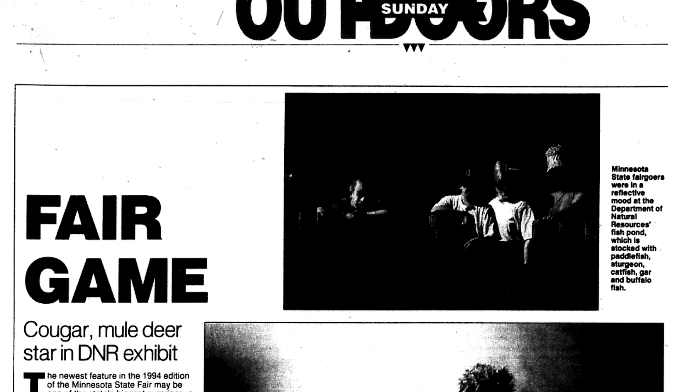
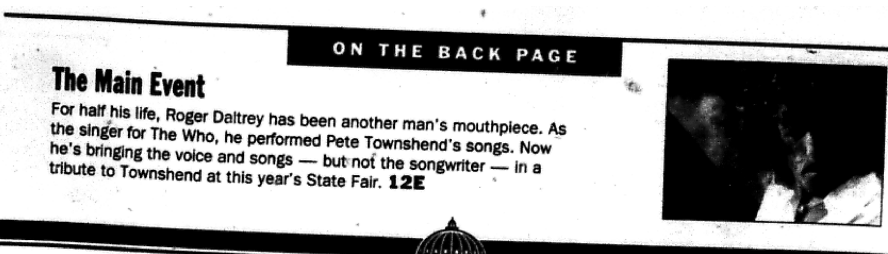
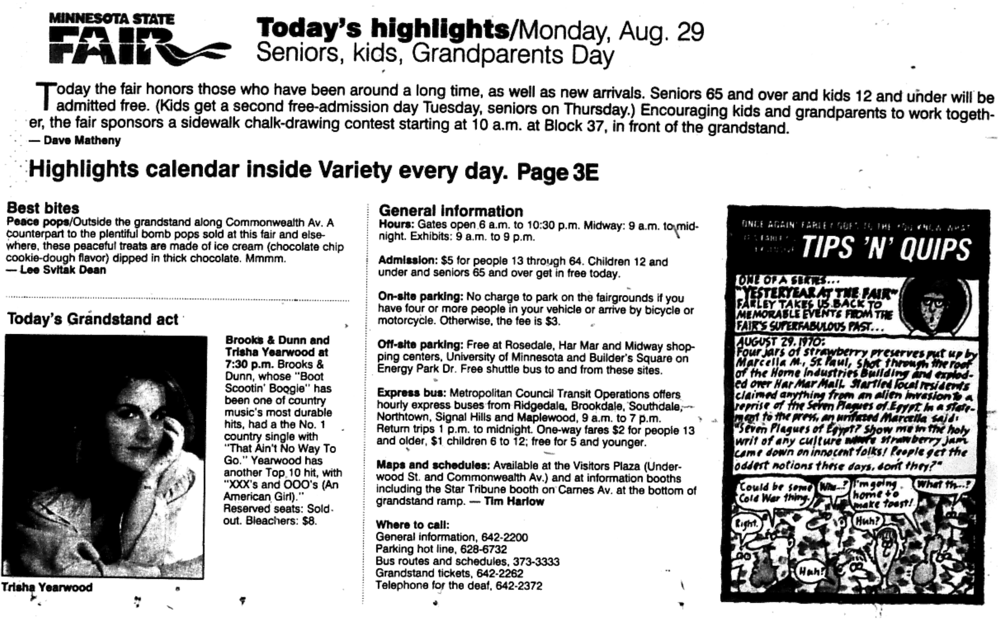
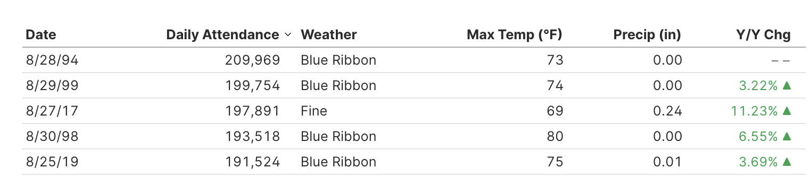
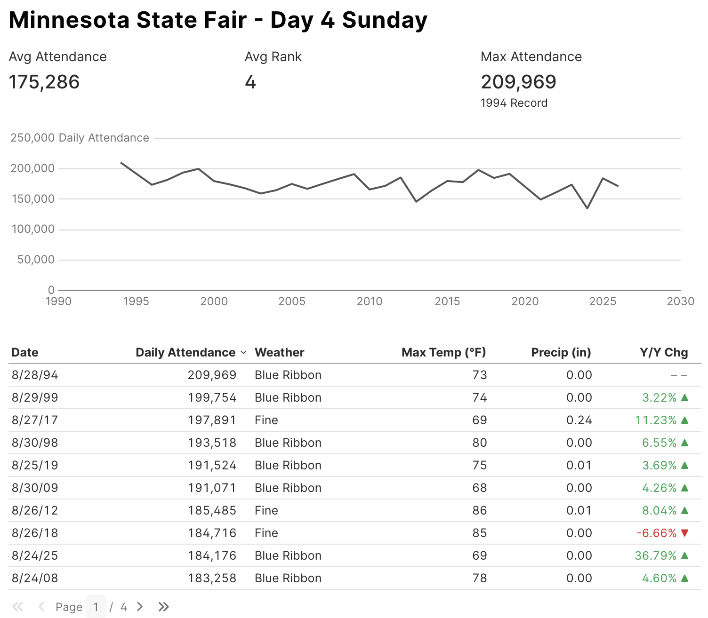

Part of the fun of the Minnesota State Fair is its deep connection to history. This event is an institution that traces its roots back to [1859](https://www.mnstatefair.org/history/), just a year after Minnesota was granted official statehood. Every summer, attendees who pass through the turnstiles are taking part in a tradition nearing two-hundred years old that has entertained generations of Minnesotans.

## Growing Population -> Growing Attendance ->  New Records

As we've already seen in [2026](https://stats.statsonastick.com/attendance/year/detail/2026/), there's a pretty strong chance that any day at the Fair could be a historic one. In the over 300 days of the Fair since 2000, [over 50 have set new all-time single day attendance records for their respective day](https://stats.statsonastick.com/attendance/records/). Much like sports statistics, comparing relative attendance performance across eras requires assumptions and context. 

For example, there is the natural starting point of total population. Minnesota continues to grow, though at a slower overall rate than states in other regions of the country.

The most recent 2025 Census estimate shows a population of nearly 5.9 million, well above the roughly 4.7 million residents recorded in 1997, the earliest year in which we were able to find full day-by-day Fair attendance figures. More people in the state leads naturally to more people available to attend the Fair, which leads to new single day attendance records.

So far, pretty stratightforward. But against this backdrop of steady growth, one single date stands out as a clear statistical anomaly.

## Day 4 is the Outlier.

Day 4, the first Sunday of the Fair, consistently shows a drop from Saturday’s traffic. That makes intuitive sense; people are pacing themselves for the week ahead, and it's a standard two-day weekend.

What doesn't make sense is this: unlike every other day in the Fair’s 12-day run, **the first Sunday has not set a single new attendance record in the 21st Century.** 

While most of these daily records have been broken multiple times over the course of the past 25+ years, Day 4 stands alone as a relic of the 1990s. The weather on First Sundays has been historically reliable, and Minnesota's population has grown by over 1.3 million people since 1994. Yet that 1994 single-day record still stands by over 10,000 visitors.

What made that specific Sunday so special?

## Traveling Through Time at the Library

Sometimes, the numbers are an invitation to dig further to find out why. Since 1994 is on the very early cusp of the Internet era, finding answers meant breaking out some equipment and skills I haven't used in a while. It was time to hit the Hennepin County Library.

Say hello to [microfiche](https://microfilmimaging.com/what-is-microfiche/), the standard compressed media storage standard of the mid 1990's. This small, unassuming box contains two full weeks of [Minneapolis Star Tribune](https://www.startribune.com/) daily editions from August 1994.

After getting reacquainted with threading the film through the reader, adjusting the focus, and mind-melding with the desktop software, I suddenly found myself back in the Nineties. 

Magic! 

With the newspaper now in hand, I started my exploration. 

I came here with two questions in mind:

* What events were scheduled for Sunday 8/28/1994?
* Was there any note on the attendance record in the following day's paper?

## August 28, 1994: Just Another Day at the Fair.

The teaser summary for this enduring record-breaker looks pretty much like any other Fair day, featuring a Milk Run and a grandstand show featuring a marquee draw, in this case a sold out Reba McEntire show.

>The five-mile Milk Run kicks off the day that pays tribute to the state's dairy industry. Feed a calf, groom a cow, judge dairy cattle and watch as experts demonstrate and talk about modern automated milking equipment at the Moo Booth in the Cattle Barn. Do-it-yourselfers can hand-milk a cow. At the American Dairy Association's booth across from the Coliseum for just 50 cents you can have all the milk you can drink.

Community runs, cow milking, and country music are all great draws, but there is nothing historically unusual about that lineup that screams record breaking.

The paper also ran this feature about a new exhibit from the DNR on cougars and mule deer.

While interesting enough for a feature in the paper, is this "10,000 more people than usual and record that will stand for over 30 years" interesting? Unlikely.

## The Next Day

Things didn't get any clearer from reading the following day's paper. My quick review of the Monday 8/29 edition did not show any notes of a record being set on Sunday. The headline over the fold teased a story on an upcoming grandstand show featuring a reduced lineup version of The Who.[^1].

## August 29, 1994: Also Just Another Day at the Fair.

The Monday Fair Preview included notes on Senior Day and another big country music show, this time a double bill with now legends Brooks & Dunn and Trisha Yearwood.

## Still a Mystery, For Now.

While digging through the Star Tribune archives was nostalgic fun, it offered no clear explanation for why this specific Sunday set such a resounding record.

In fact, the mystery runs deeper than just this one weekend in 1994. Not only hasn't the record been broken in years, 3 of the top 4 record attendance days for Day 4 were set in the 1990s. 

It might even have more than this, as our records are incomplete. Was the first Sunday generally a bigger deal back then? 

We'll just have to save this question for later, unless of course today sets a new standard.

## Will This Be The Year?

If any year has a shot at breaking this long-standing record, 2026 is making a case. The first two days set new all-time highs. However, looking at Saturday's totals, which came in under 2025's Day 3 attendance and well off the record pace, it could be this record and the mystery around it will remain one more year.

We'll find out tomorrow!

## Update 8/31/2026: Meet the New Boss, Same as the Old Boss.

That 1994 Sunday record just gets more extraordinary by the year, adding 2026 to the list of also-rans.

Seeing the preceding Saturday's traffic peak under 200,000 was probably the first clue that this record was in no danger of falling. The final tally of 171,054 was not only off the record pace, it was a couple ticks below the current average Day 4 attendance and didn't even crack the Top 10.

A few hot take theories on why this year wasn't the year:

* Kids returning to school early?
* Front loaded visits on Thursday/Friday/Saturday?
* People just plan to visit later?

We'll have all offseason to dig into the reasons. 

In the meantime, we will continue to ponder and admire the legendary single day Day 4 Sunday record, a time capsule from 1994.

---

[^1]: Pete Townshend's brother Simon filled in for him on this tour. Things between Roger and Pete [remain complicated to this day](https://people.com/pete-townshend-and-who-bandmate-roger-daltrey-dont-communicate-very-well-11792896).