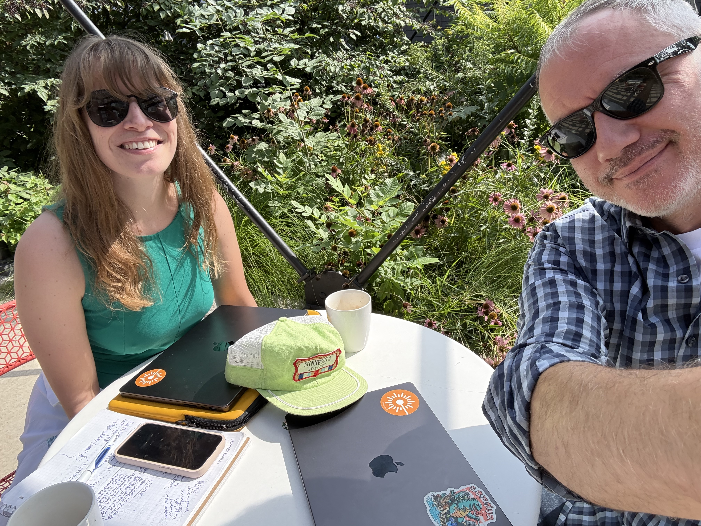

The Minnesota State Fair is like a great work of art. No two people experience it the same way.

For some, the State Fair is a can't-miss event that represents the twelve best days of summer. For others, the very thought of braving the crowds stirs equal parts excitement and anxiety. Wherever your opinion falls, the Fair is a Minnesotan cultural touchstone that is at once timeless and ever-changing.

The national reputation of our humble Fair has only grown with time. Of course, the people of our region are known for their friendly yet reserved nature. Shows of emotion or boasting are not really our thing.

[OK, fine. Maybe just this once.](https://10best.usatoday.com/awards/minnesota-state-fair-st-paul-minnesota/)

[Or maybe again.](https://www.travelandleisure.com/best-state-fair-for-2026-in-usa-12019392)

[Just one more.](https://www.thrillist.com/travel/nation/best-state-fairs-in-the-us)

## Stats and Stories, Intertwined

It's with deep-seated curiosity and a love of the Fair that we set out to present the numbers and discover the stories behind this great event. Not surprisingly, we found plenty to dig through!

* **A Small Mystery**: Since 2000, 11 out of 12 individual days of the Fair have set new all-time attendance records, most of them several times. So what's up with Day 4?
* **Blue Ribbon Weather**: What makes an ideal Fair day? What impacts attendance?
* **Corn Dogs vs. Pronto Pups**: Let's settle this once and for all.
* **2025**: How did attendance finish, and where was there a surprising lull?

We also approach this as an input to the decisions attendees make around their Fair experience. What day would be best for you and your party to visit? 

## Your Hosts and Fair Friends

A native of Chicago, Brian Seebacher is a relative newcomer to Minnesota, having arrived in 1995. He only began attending the Fair annually in 2004. (Try not to hold it against him.)

Kathryn Zessman is a lifelong Minnesotan and Fair super-fan.

We come to this project with data analytics skills we've honed through years of working with our clients in various industries, specifically non-profits and associations. Our backgrounds are in research, decision intelligence, and data platform development, which we use to help organizations apply their data to support better strategic decision-making.

Above all, though, we're here to learn. Some of the work we will be presenting over the next couple of weeks has pushed us to think differently and exercise skills that are not second nature to us. To be clear, we don't have all the answers. We're not economists by trade, nor are we advanced statisticians. Learning in public can be tricky, so you may have to bear with us as we figure it out together. That said, we think we have some interesting stories to share.

And to make one thing crystal clear, **we are not officially affiliated with the Minnesota State Fair.**  We're just a couple of Minnesotans who love data, the Fair, asking questions, and finding answers.

## What's Next?

You can [watch our site](https://stats.statsonastick.com/) daily for an update on attendance, which we will post after attendance figures become publicly available.

For extra fun (i.e., for entertainment only), we also put together [a pre-Fair forecast of 2026 attendance](https://stats.statsonastick.com/attendance/forecast/). We're projecting a return to over 2 million through the gates this year, though a bit shy of the [all-time record set in 2019](https://stats.statsonastick.com/attendance/year/detail/2019/). 

Will we be on the mark? Stick around to find out.

## Go Enjoy the Fair!

We hope to see you there!